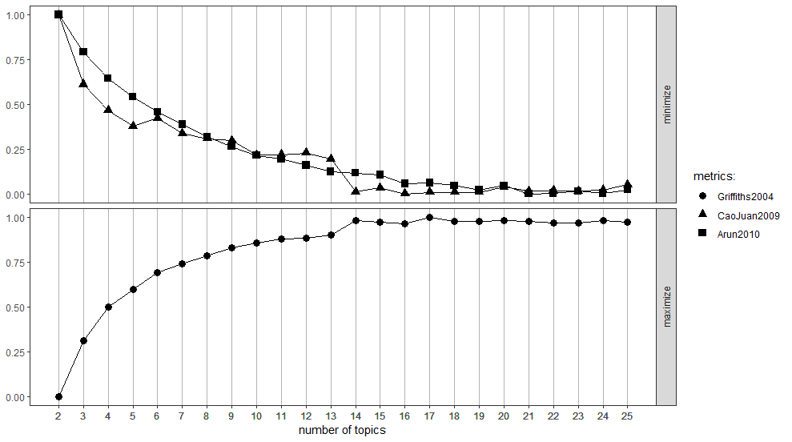

##Topic Modeling with Automated Determination of the Number of Topics

This post uses R markdown to explain my version of topic modelling using Latent Dirichlet Allocation (LDA) which finds the best number of topics for a set of documents using log-likelihoods and computation of harmonic means (this approach has been adapted from [here](https://stackoverflow.com/questions/21355156/topic-models-cross-validation-with-loglikelihood-or-perplexity/21394092)). Specifically, this post

*   discusses getting started with the necessary libraries needed for the analysis
*   provides the initiaization of several variables needed and loads the necessary dataset
*   outlines the pre-processing steps to cleanse the data before analysis
*   demonstrates how the optimum number of topics for the dataset is obtained
*   presents a visualization of the results of LDA

## Getting started
The below-mentioned libraries are needed for the analyis to work. Install them from CRAN if it is not present in your version of R.


```r
rm(list = ls()) #clear the variables (just in case)

#load text mining library
library(tm)
library(slam)
#load topic models library
library(topicmodels)
library(rjson)
library(snow)
library(parallel)
library(stringr)
library(stringi)
#FOr topic visualization
library(LDAvis)
library(dplyr)
#this library is for presenting outputs in a nice dignified way
library(knitr)
```

Here, the harmonic mean function for a lognormal distribution is defined for analysis later.


```r
harmonicMean <- function(logLikelihoods, precision = 2000L) {
  library("Rmpfr")
  llMed <- median(logLikelihoods)
  as.double(llMed - log(mean(exp(
    -mpfr(logLikelihoods,
          prec = precision) + llMed
  ))))
}
```

## Initialization of variables
Here, some of the variables will be initialized which will be used later for analysis. First, the stopwords are defined (which we will use the default available from the *tm* library). Then, the parameters for the LDA are defined. Lastly, the range of numbers within which the optimum topic number for the data set is to be found is defined.


```r
#define all stopwords
genericStopwords <- c(
  stopwords("english"),
  stopwords("SMART")
)
genericStopwords <- gsub("'", "", genericStopwords)  #remove apostrophes
genericStopwords <- unique(genericStopwords)
#genericStopwords <- stemDocument(genericStopwords, language = "porter")

#Set parameters for Gibbs sampling for LDA
nstart <- 5
seed <-
  list(5,
       46225,
       500,
       6300,
       190000)
best <- TRUE
burnin <- 5000
iter <- 10000
keep <- 100

#Range of topic numbers to search for optimum number
sequ <-
  seq(2, 25, 1) 
```

## Data loading and pre-processing of data (i.e. cleansing)
Here we use the data set that comes is available at this [link](http://hereticsconsulting.files.wordpress.com/2016/01/textmining.zip). After loading the data set, the data is pre-processed by converting all characters to lower case. Sentences shorter than 8 words are removed. Punctuation, control characters, numbers and whitespace are removed. The data is then loaded into a corpus as a format which the library can analyze. Stopwords are removed here.If needed, stemming can be done after the removal of stopwords. But, in my case, I prefer not to use it as some words after truncation become quite indecipherable. Lemmatization would be a better option here. As of now, I have not tried it out yet.


```r
#load files into corpus
#get listing of .txt files in directory
filenames <- list.files(paste(getwd(),"textmining",sep = "/"),pattern="*.txt",full.names = TRUE)

#read files into a character vector
data_orig <- lapply(filenames,readLines)

#pre-processing:
data <- tolower(data_orig)  #force to lowercase
data[stri_count(data, regex="\\S+") < 8] = ""
data <- gsub("'", "", data)  #remove apostrophes
data <-
  gsub("[[:punct:]]", " ", data)  #replace punctuation with space
data <-
  gsub("[[:cntrl:]]", " ", data)  #replace control characters with space
data <-
  gsub("[[:digit:]]", "", data)  #remove digits
data <-
  gsub("^[[:space:]]+", "", data) #remove whitespace at beginning of documents
data <-
  gsub("[[:space:]]+$", "", data) #remove whitespace at end of documents
data <- stripWhitespace(data)

#load files into corpus
#create corpus from vector
data_docs <- Corpus(VectorSource(data))

#inspect a particular document in corpus
writeLines(as.character(data_docs[[2]]))
```

```
c big data metaphors we live by when big data metaphors erase human sensemaking and the ways in which values are baked into categories algorithms and visualizations we have indeed lost the plot not found it quoted from my essay on metaphors for big data co written with simon buckingham shum
```

```r
#Removal of stopwords
data_docs <- tm_map(data_docs, removeWords, genericStopwords)

#Good practice to check every now and then
writeLines(as.character(data_docs[[2]]))
```

```
 big data metaphors  live   big data metaphors erase human sensemaking   ways   values  baked  categories algorithms  visualizations    lost  plot  found  quoted   essay  metaphors  big data  written  simon buckingham shum
```

## Creation of document term matrix and summary of terms
The document-term matrix is then created so that terms that occur in less than 1% of the documents are removed as well. These terms are unlikely to have an impact in finding topics.


```r
#Create document-term matrix
dtm <- DocumentTermMatrix(data_docs)
#remove terms that occur in less than 1% of the documents
ind <- col_sums(dtm) < length(data) * 0.01
dtm <- dtm[,!ind]
#remove documents with no terms
ind <- row_sums(dtm) == 0
dtm <- dtm[!ind,]
data_docs <- data_docs[!ind]
#collapse matrix by summing over columns
freq <- col_sums(dtm)
#create sort order (descending)
freq <- freq[order(freq, decreasing = TRUE)]
#List all terms in decreasing order of freq
term_count_table <-
  data.frame(
    Term = names(freq),
    Count = unname(freq)
  )
kable(term_count_table[1:25,]) #show first 25 rows
```


Term             Count
--------------  ------
work               161
people             143
data               141
project            128
approach           121
management         121
problem            117
time               101
question            98
system              98
point               96
things              96
enterprise          93
change              88
systems             87
important           84
based               82
business            82
process             78
decision            78
organisations       75
organization        70
make                68
good                67
ibis                66

## LDA Analysis
As there is a range of topic numbers to analyze, each topic modeling process can be processed in a parallel manner as they are independent of each other. So here, I make use of all the cores in the system to speed up the analysis. Once the analysis is done, the log-likelihoods are extracted from every model and used to compute the harmonic means. The harmonic means are then plotted (this is for visualization purposes). The index at which the harmonic mean has a maximum values is the optimum number of topics for the data set. Using the index found, the topic model is extracted out for visualization.


```r
#Run LDA using Gibbs sampling
##Calculate the number of cores
no_cores <- detectCores()
cl <- makeCluster(no_cores)
clusterExport(
  cl,
  list(
    "dtm",
    "sequ",
    "nstart",
    "seed",
    "best",
    "burnin",
    "iter",
    "keep"
  )
)

#Run LDA through all the numbers in the range and store all the models found in fitted_many
fitted_many <- clusterApplyLB(
  cl,
  sequ,
  fun = function(i) {
    library(topicmodels)
    LDA(
      dtm,
      k = i,
      method = "Gibbs",
      control = list(
        nstart = nstart,
        seed = seed,
        best = best,
        burnin = burnin,
        iter = iter,
        keep = keep
      )
    )
  }
)
stopCluster(cl)

#extract logliks from each topic
#where keep indicates that every keep iteration the log-likelihood is evaluated and stored. This returns all log-likelihood values including burnin, i.e., these need to be omitted before calculating the harmonic mean:
logLiks_many <-
  lapply(fitted_many, function(L)
    L@logLiks[-c(1:(burnin / keep))])

#compute harmonic means
hm_many <- sapply(logLiks_many, function(h)
  harmonicMean(h))
```


```r
#inspect
plot(sequ, hm_many, type = "l")
```

<!-- -->


```r
#compute optimum number of topics & extract relevant topic models
ind <- which.max(hm_many)
print(paste("The optimum number of topics for the data set is ",sequ[ind]))
```

```
[1] "The optimum number of topics for the data set is  17"
```

```r
ldaOut <- fitted_many[ind]
ldaOut <- ldaOut[[1]]
```

## Topic Visualization
The visualization of topics is done using the *LDAvis* library. Once again, parallel processing is employed to speed up determining visualization parameters. The visualization parameters are saved in a json file which is then loaded via *serVis()* to create the interactive HTML files for visualization, You may view an example of the result at the following [link](https://www-drv.com/site/yf6iluuabcbqwj4lazddda/Vis/index.html). **Note:** Since LDA is unsupervised, the results may change everytime that the analysis is run. The results in the link is just an example of such an instance.


```r
##Prepare data for Visualization
#Calculate the number of cores
no_cores <- detectCores()
cl <- makeCluster(no_cores)

#Find required quantities
phi <- posterior(ldaOut)$terms %>% as.matrix
theta <- posterior(ldaOut)$topics %>% as.matrix
vocab <- colnames(phi)
doc_length <- vector()
for (i in 1:length(data_docs)) {
  temp <- paste(data_docs[[i]]$content, collapse = ' ')
  doc_length <- c(doc_length, stri_count(temp, regex = '\\S+'))
}

json_lda <- LDAvis::createJSON(
  phi = phi,
  theta = theta,
  vocab = vocab,
  doc.length = doc_length,
  term.frequency = col_sums(dtm),
  R = 10,
  cluster = cl,
  plot.opts = list(xlab = "Dimension 1", ylab = "Dimension 2")
)
stopCluster(cl)

#Topics visualization
serVis(
  json_lda,
  out.dir = "Vis"
)
```
